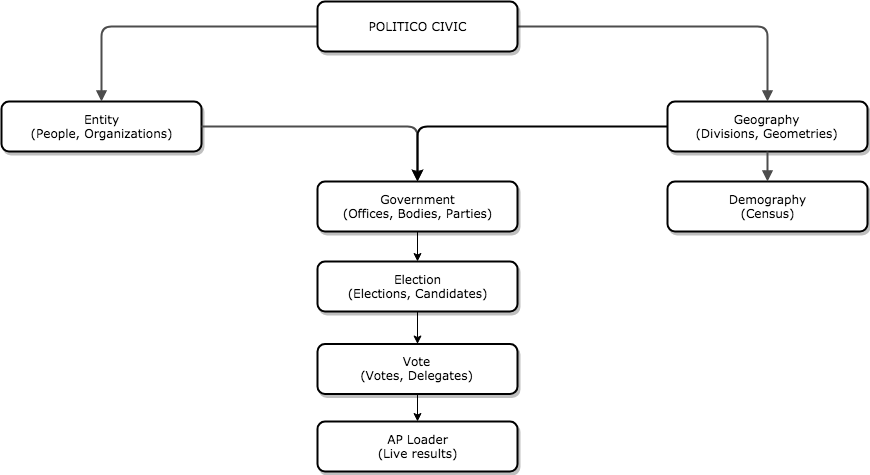

Why this?
=========

At POLITICO, civic data is a key component of our report. We record the results of every federal election in the country. We track the movements of prospective presidential candidates. We collect campaign finance data. All of these data tasks require the same foundation of data. Thus, the POLITICO Civic project was born.

If you work in a newsroom or with any civic data project, you might have similar problems to solve. Newsrooms across the United States spend many months every two years (at least) building the same piece of technology: a system to ingest election results as quickly as possible and display them with fancy data visualizations. By sharing POLITICO Civic, we hope to deescalate that arms race.

What is it?
-----------

POLITICO Civic is a Django project composed of a number of pluggable Django apps. Each of the pluggable apps contains models around a particular facet of civic data and standard serializers that allow us to pass data around through JSON. At the bottom of the app tree, the apps contain front-end applications for live results, election calendars and other data-driven displays.

To date, the app tree and its dependency structure is described here in a big scary dependency diagram.

Don't run away! I promise this makes sense!

Benefits
--------

**Modularity**: We designed our project this way to make each component of civic data easier to reason about. And when we start supporting other types of civic data, we don't have to add bloat to another Django application. We've designed in a way that allows us to start that app from scratch and pull in the dependencies we need.

**Predictable structure**: During high-stress live events such as election nights, having a strong schema and foundation for all of the underlying data that goes into an election night — information about political offices, geography, election cycles, primary conditions, and more — lets us breathe a little easier and focus more on what is new about that night: the results.

**Reusability**: Some of these applications are useful outside the context of POLITICO Civic. For example, Geography contains all of the geographic data for political divisions in the United States. It comes with a bootstrap process built-in that grabs the latest geodata for states, counties and Congressional districts from the U.S. Census Bureau. It can also compress that data into topojson and dump it to Amazon S3. That is useful for any newsroom that might make maps of the United States.

Core technologies
-----------------

POILTICO Civic is based on several key pieces of technology:

- `Python <https://www.python.org/>`_ (3.6+)
- `Django <https://www.djangoproject.com/>`_ (2.0+)
- `PostgreSQL <https://www.postgresql.org/>`_
- `Django REST Framework <http://www.django-rest-framework.org/>`_
- `Celery <http://www.celeryproject.org/>`_
- `Elex <http://elex.readthedocs.io/en/stable/>`_
- `Fabric <http://www.fabfile.org/>`_

Our model architecture took inspiration from a couple inspired projects:

- `opencivicdata <https://opencivicdata.readthedocs.io/en/latest/>`_
- `Popolo <https://www.popoloproject.com/>`_